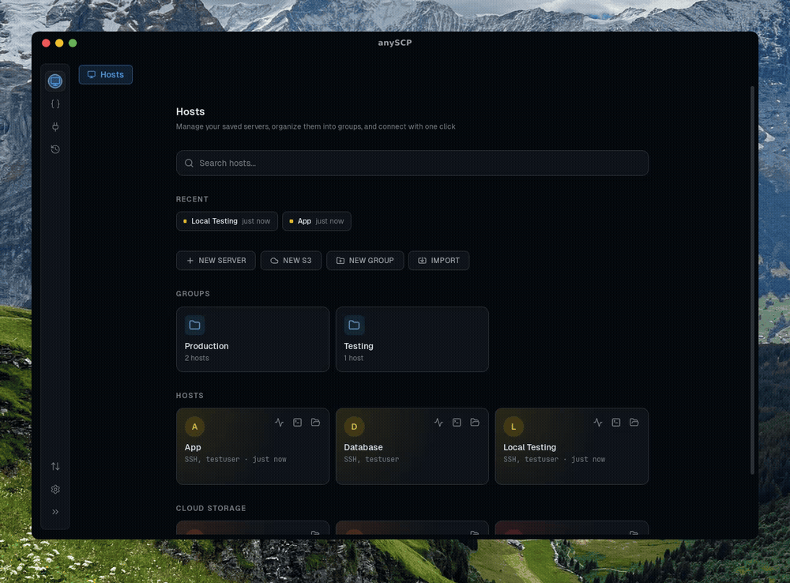

<p align="center">
  
</p>

<p align="center">
  <strong>现代化的 SSH、SFTP、S3 桌面客户端，界面简洁、功能强大</strong>
</p>

<p align="center">
  <a href="README.md">English</a> &bull; <a href="README.zh-CN.md">简体中文</a>
</p>

<p align="center">
  <a href="#功能特性">功能特性</a> &bull;
  <a href="#截图">截图</a> &bull;
  <a href="#安装">安装</a> &bull;
  <a href="#构建">构建</a> &bull;
  <a href="#参与贡献">参与贡献</a> &bull;
  <a href="https://discord.gg/3xNRbNAmYb">Discord</a> &bull;
  <a href="https://join.slack.com/t/anyssh/shared_invite/zt-40b1jsfg4-f9rq_xRof_MVQqLXSPDE2Q">Slack</a> &bull;
  <a href="#开源协议">开源协议</a>
</p>

<p align="center">
  <a href="https://github.com/jincaiw/anySSH/releases"></a>
  <a href="https://github.com/jincaiw/anySSH/releases"></a>
  
  <a href="LICENSE"></a>
  <a href="https://github.com/jincaiw/anySSH/stargazers"></a>
  <a href="https://discord.gg/3xNRbNAmYb"></a>
  <a href="https://join.slack.com/t/anyssh/shared_invite/zt-40b1jsfg4-f9rq_xRof_MVQqLXSPDE2Q"></a>
</p>

<p align="center">
  Termius、PuTTY、WinSCP 的免费开源替代品。<br/>
  跨平台 SSH 客户端、SFTP 文件管理器与 S3 桌面浏览器，支持分屏、拖拽上传、命令片段。
</p>

---

<p align="center">
  
</p>
<p align="center"><em>SSH 终端、SFTP 文件管理、S3 云存储 —— 一个应用全搞定。</em></p>

---

## 🚀 项目简介

AnySSH 是一款免费开源的桌面应用，将 SSH 终端、SFTP 文件浏览器和 S3 兼容云存储浏览器整合到一个快速、隐私优先的工具中。基于 Tauri v2（Rust 后端 + React 前端）构建，原生运行于 macOS、Windows 和 Linux。无需云端账号、没有订阅 —— 你的凭据只保存在你自己的电脑上。

## ⚡ 与同类工具对比

| 功能             | AnySSH      | Termius  | PuTTY   | WinSCP  | Cyberduck |
| ---------------- | ----------- | -------- | ------- | ------- | --------- |
| SSH 终端         | 支持        | 支持     | 支持    | 不支持  | 不支持    |
| SFTP 浏览        | 支持        | 支持     | 不支持  | 支持    | 支持      |
| S3 浏览          | 支持        | 不支持   | 不支持  | 不支持  | 支持      |
| 分屏             | 支持        | 支持     | 不支持  | 不支持  | 不支持    |
| 端口转发         | 支持        | 支持     | 支持    | 不支持  | 不支持    |
| 命令片段         | 支持        | 支持     | 不支持  | 不支持  | 不支持    |
| 跨平台           | 支持        | 支持     | Windows | Windows | 支持      |
| 免费无限制       | 支持        | 不支持   | 支持    | 支持    | 支持      |
| 无需注册账号     | 支持        | 不支持   | 支持    | 支持    | 支持      |
| 开源             | 支持        | 不支持   | 支持    | 支持    | 支持(GPL) |
| 凭据隐私         | 本地(钥匙串) | 云端同步 | 本地    | 本地    | 本地      |

## ✨ 功能特性

- **中英双语界面** — 简体中文 / English，可在 **设置 → 外观** 中切换（首次启动跟随系统语言）

### 💻 SSH 终端客户端

- 基于 xterm.js 的全功能终端模拟器，GPU 加速的 WebGL 渲染
- 终端配色主题：内置 6 套配色（Homebrew、One Dark Pro、Dracula、Solarized Dark、Tomorrow Night、Nord），可实时切换
- 自定义主题：全部 22 个颜色位（背景、前景、光标、选区、ANSI 16 色）均可用取色器调整
- 支持导入 iTerm2 `.itermcolors` 主题文件
- 单连接主题覆盖 + 全局默认，重启后保持
- 会话日志 — 完整记录终端输出，密码自动打码、ANSI 保留/剥离、滚动切割、保留期/配额自动清理、内置查看器（支持搜索）与导出
- 单个 SSH 会话内拆分终端面板（水平 / 垂直）
- 终端内搜索，支持正则表达式
- 标签页管理 SSH 会话，支持键盘快捷键
- 可配置保活间隔、启动命令、默认 Shell、代理跳转（堡垒机）
- SSH 密钥认证，自动完成 PPK 到 OpenSSH 格式转换
- 从 `~/.ssh/config` 导入连接
- 单主机终端编码与 LANG 环境变量设置（GBK / Big5 / Shift_JIS 等场景）
- 双因子键盘交互认证策略（堡垒机动态码场景）
- 未保存密码的主机连接时交互式弹窗输入密码

### 📁 SFTP 文件管理器

- 浏览、上传、下载、重命名、移动、复制、删除远程文件和目录
- 从桌面直接拖拽文件到远程文件浏览器上传
- Ctrl+点击 / Shift+点击 多选文件，批量操作
- 远程目录间剪切、复制、粘贴文件
- 内联新建文件和文件夹
- 在 VS Code 中编辑远程文件 —— 保存时自动重新上传
- 传输队列：实时进度条、传输速度、剩余时间
- 可配置并行度的并发传输

### ☁️ S3 云存储浏览器

- 连接 **Amazon S3**、**MinIO**、**Cloudflare R2**、**Backblaze B2**、**Wasabi**、**DigitalOcean Spaces** 或任何 S3 兼容存储
- 与 SFTP 完全一致的文件浏览界面 —— 排序、多选、右键菜单、快捷键
- 拖拽上传，支持递归上传整个目录
- 新建文件、新建文件夹、批量删除（含递归删除文件夹）
- 生成并复制预签名 URL 用于分享
- 在 VS Code 中编辑 S3 对象，保存自动重新上传
- 传输进度跟踪（速度、剩余时间）
- 单个连接内切换多个存储桶

### 🔗 服务器与连接管理

- 保存 SSH 主机和 S3 连接，支持标签、颜色、环境标记、备注
- 将连接组织到带颜色的分组中
- 一键从 `~/.ssh/config` 导入 SSH 主机
- 一键连接，凭据存放在操作系统钥匙串中
- 最近连接列表，快速访问
- 完整的连接历史与审计日志

### 📋 命令片段库

- 保存常用 Shell 命令，带标签和描述
- 支持 `{{变量}}` 占位符的参数化命令模板
- 将片段组织到文件夹中
- 任意终端会话中打开快速插入面板
- 全文搜索所有已保存的片段

### 🔀 SSH 端口转发

- 设置本地和远程 SSH 隧道
- 按主机创建、启动、停止端口转发规则
- 隧道自动建立独立 SSH 连接 —— 无需打开终端会话
- 实时监控活动隧道状态
- 常用服务预设（PostgreSQL、MySQL、Redis、MongoDB、HTTP、Kubernetes）

### 🔐 安全与隐私

- 凭据保存在**操作系统钥匙串**中（macOS Keychain、Windows 凭据管理器、Linux libsecret/KWallet）
- SSH 私钥和密码永不离开 Rust 后端进程
- 完全离线 —— 安装后无需联网
- 开源 —— 代码可自行审计

## 📸 截图

|                    连接管理器                    |                  SSH 终端                  |
| :----------------------------------------------: | :----------------------------------------: |
|                   |           |
| _分组、颜色、标记管理服务器_                      | _分屏、搜索、多标签会话_                    |

|                  文件浏览器                      |                  命令片段                   |
| :----------------------------------------------: | :-----------------------------------------: |
|               |            |
| _SFTP 与 S3 拖拽、右键菜单_                      | _参数化模板快速插入_                        |

## 📥 安装

### 下载

1. 从 [Releases](https://github.com/jincaiw/anySSH/releases) 页面下载最新版本
2. 根据平台选择对应文件：
   - **macOS（Apple Silicon）**：`.dmg`（aarch64）
   - **macOS（Intel）**：`.dmg`（x64）
   - **Windows**：`.msi` 或 `.exe`
   - **Linux**：`.deb` 或 `.AppImage`
3. 安装并启动

> **macOS 提示**：如遇"应用已损坏"提示，执行：`xattr -cr /Applications/anyssh.app`

### 便携版

每个 Release 同时提供**便携版**压缩包（文件名含 `portable`），免安装：

- **Windows**：`anySSH_<version>_windows_x86_64_portable.zip`
- **Linux**：`anySSH_<version>_linux_x86_64_portable.tar.gz`
- **macOS**：`anySSH_<version>_macos_<arch>_portable.zip`

解压到任意位置直接运行。便携模式下**所有数据** —— 主机、分组、历史、设置、命令片段、凭据 —— 都保存在程序旁边的 `anySSH-Data` 文件夹中，整个文件夹可以放在 U 盘上、在多台电脑间使用。请保持 `portable.txt` 与程序同目录：该标记文件是便携模式的开关，缺失时应用按常规安装模式运行。

便携模式下的凭据使用 AES-256-GCM 加密保存于 `anySSH-Data/vault.anyssh`，由密钥文件 `anySSH-Data/vault.key` 加密封装。请整体备份 `anySSH-Data` 文件夹 —— 没有密钥文件，保险库无法读取。（安装版则使用操作系统钥匙串。）

### 更新

已安装 anySSH？进入 **设置 → 关于与更新**，点击**检查**即可应用内更新 —— 也可以开启**自动更新**，自动安装新版本。

### 系统要求

- macOS 11+、Windows 10+ 或 Linux（Ubuntu 22.04+）
- SFTP：远程服务器的 SSH 访问权限
- S3：Access Key 和 Secret Key（或 S3 兼容凭据）

## 🔨 构建

### 环境要求

- [Node.js](https://nodejs.org) 18+
- [pnpm](https://pnpm.io)
- [Rust](https://rustup.rs)（最新稳定版）
- 平台相关 Tauri 依赖：[Tauri 环境要求](https://v2.tauri.app/start/prerequisites/)

### 构建步骤

```bash
# 克隆仓库
git clone https://github.com/jincaiw/anySSH.git
cd anySSH

# 安装前端依赖
pnpm install

# 开发模式运行（热重载）
pnpm tauri dev

# 生产构建（生成对应平台的安装包）
pnpm tauri build
```

## 🛠 技术栈

| 层级           | 技术                                                |
| -------------- | --------------------------------------------------- |
| 桌面运行时     | [Tauri v2](https://v2.tauri.app)                    |
| 后端           | Rust（tokio、russh、russh-sftp、rust-s3、rusqlite） |
| 前端           | React 19、TypeScript（严格模式）、Tailwind CSS v4   |
| 终端           | xterm.js（WebGL 渲染器）                            |
| 状态管理       | Zustand                                             |
| 凭据存储       | 操作系统钥匙串（`keyring` crate）                   |
| 数据库         | SQLite（内嵌、零配置）                              |

## 🏗 架构

AnySSH 遵循严格的前后端分离：

- **Rust 承担重活** —— 所有 SSH、SFTP、S3、加密和文件 I/O 都在 Rust 中运行
- **React 是薄视图层** —— 渲染 UI，通过 Zustand 管理本地状态
- **Tauri IPC** 以类型安全的命令（请求/响应）和事件（服务器推送）桥接两者
- **凭据不跨越 IPC 边界** —— 前端永远看不到密码和私钥
- **共享 `FileSystemProvider` 抽象** —— SFTP 和 S3 浏览器复用相同的 UI 组件，通过能力标志位按协议显示/隐藏功能

### 项目结构

```
src/                          # React 前端
  components/
    terminal/                 # SSH 终端、分屏、搜索、会话日志
    explorer/                 # 共享文件表格、工具栏、拖放区
    sftp/                     # SFTP 浏览器、会话标签
    s3/                       # S3 浏览器、连接对话框
    dashboard/                # 主机卡片、分组、连接管理
    snippets/                 # 命令片段库
    transfers/                # 传输进度弹层
  stores/                     # Zustand 状态仓库
  providers/                  # SFTP 与 S3 文件系统 provider
  types/                      # TypeScript 类型定义

src-tauri/src/                # Rust 后端
  ssh/                        # SSH 连接、PTY、密钥管理、会话日志
  sftp/                       # SFTP 会话、传输管理
  s3/                         # S3 会话、传输管理
  db/                         # SQLite 持久层
  vault/                      # 操作系统钥匙串集成、便携保险库
  snippets/                   # 命令片段存储
  portforward/                # SSH 隧道管理
  import/                     # SSH 配置解析
```

## 🤝 参与贡献

欢迎贡献！参与方式：

1. **Fork 本仓库**
2. **创建功能分支**：`git checkout -b feature/amazing-feature`
3. **提交更改**：`git commit -m 'Add amazing feature'`
4. **推送分支**：`git push origin feature/amazing-feature`
5. **发起 Pull Request**

请先创建 Issue 讨论你想做的变更。

## 🐛 故障排查

### SSH 连接问题

- **无法连接**：检查主机、端口、用户名和凭据
- **认证失败**：检查密码或 SSH 密钥权限
- **超时**：检查防火墙设置和网络连通性

### S3 连接问题

- **Access Denied**：确认 Access Key 和 Secret Key 正确
- **Bucket 不存在**：检查存储桶名称和区域设置
- **凭据无效**：确认 IAM 用户具有 S3 权限

### 文件操作

- **权限拒绝**：确认用户具有相应文件权限
- **上传失败**：检查远程服务器磁盘空间

### macOS

- **"应用已损坏"**：执行 `xattr -cr /Applications/anyssh.app`

## 📄 开源协议

本项目基于 MIT 协议开源 —— 详见 [LICENSE](LICENSE) 文件。

## 🙏 致谢

- **anySSH 是 [anySCP](https://github.com/macnev2013/anySCP)（作者 Nevil Macwan）的 fork** —— 衷心感谢原作者的杰出工作。上游项目 README 声明采用 MIT 协议；本 fork 继续沿用 MIT，并在 [LICENSE](LICENSE) 文件中保留原版权声明。
- 基于 [Tauri](https://tauri.app) 构建
- SSH 实现来自 [russh](https://github.com/warp-tech/russh)（Apache-2.0，本地补丁见 `src-tauri/vendor/russh`）
- 终端模拟来自 [xterm.js](https://xtermjs.org)
- S3 支持来自 [rust-s3](https://github.com/durch/rust-s3)

## 💬 支持

- **Discord**：[加入社区](https://discord.gg/3xNRbNAmYb)
- **Slack**：[加入工作区](https://join.slack.com/t/anyssh/shared_invite/zt-40b1jsfg4-f9rq_xRof_MVQqLXSPDE2Q)
- **Issues**：[GitHub Issues](https://github.com/jincaiw/anySSH/issues)
- **Discussions**：[GitHub Discussions](https://github.com/jincaiw/anySSH/discussions)

---

<p align="center">
  如果 anySSH 对你有帮助，欢迎在 <a href="https://github.com/jincaiw/anySSH">GitHub</a> 上点一个 star！
</p>

<p align="center">
  <a href="#top">回到顶部</a>
</p>
